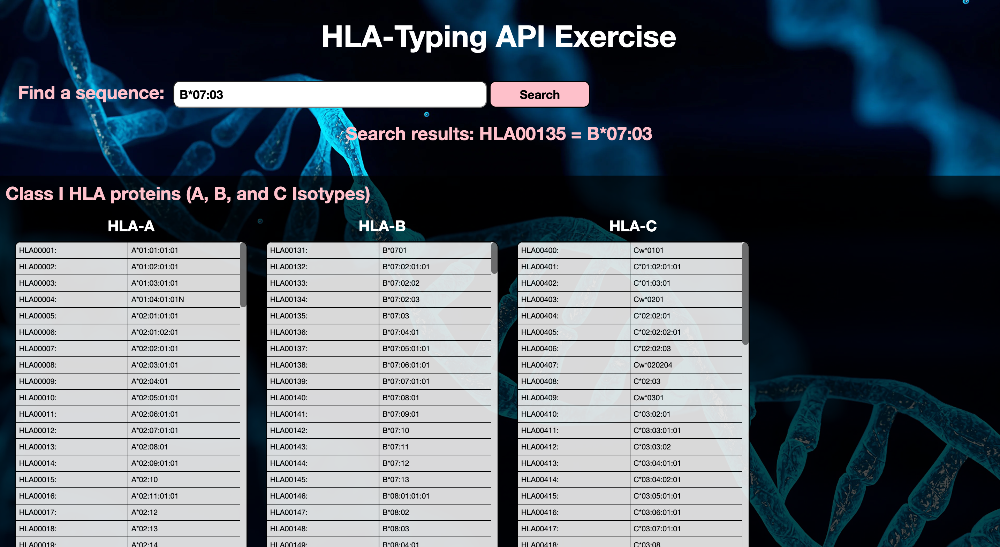

# RESTful API Exercise

## **Created by Emily Ryan for Scisco Genetics**
The information provided on this website comes from the [Immuno Polymorphism Database (IPD)](https://www.ebi.ac.uk/ipd/).
The API used for the specific data displayed can be found [here](https://www.ebi.ac.uk/ipd/rest/#/Allele%20API/listAlleles).
## **Live deployment:**
https://emilyjryan.github.io/allele-api-exercise/

## **Design**

## **Installation Instructions:**
* Fork and clone this repository to your local device
* Open `index.html` with your live server or navigate to http://localhost:5501.

## **Project Steps**:

1. I started by creating a new github repository to keep things organized and created all the necessary files for building the webpage. I decided to use a tech stack of JavaScript (JS), HTML5, and CSS.

2. I tested the API first in Thunder Client to ensure I could get the data successfully and also to examine the structure of the data received.

3. I then linked my HTML, CSS, and JS files together. I created the basic overall HTML structure for the website. I created JS variables from the HTML elements for easy access for DOM manipulation.

4. Next I wrote the basic fetch request function, converted the data to json, used console.logs to evaluate the structure of the data, and added error catching functionality at the end in case there was an issue with the request. I created a variable array to hold all incoming data from request.

5. I built a for loop to run through all the data and create new HTML elements for each allele accession/name pair. I added some conditional logic (if/else) to the functionality to aid in organizing the data based on isotype starting letter for easier reading of the data.

6. Then I added some styling and page structure, including columns, scrolling functionality, and scrollbars for all the data. I then attached a background image.

7. To make my code easier to read, I moved some of the functions originally written within the fetch functionality back up into the global scope for better readability and organization.

8. Since the data sometimes takes a few seconds to load in the browser, I added a loading message to display while the user waits.

9. I then created a search input and button with functionality so a user can search for a specific allele sequence. The function returns the specific sequence as well as the accession number.

10. To help the reader better understand the contents of each column, I added functionality for displaying the total number of entries for each column.

## **Decisions**

### Client Side Rendering:
I decided to use client side rendering because initially it seemed like the simpler way to go, even though it would potentially mean the screen load time was slower. After testing the API on 1000 data points, I noticed it only took a few seconds to load so I decided that client-side rendering would be sufficient for a project this size. However, with a larger set of data or a longer load time, I would consider using server-side rendering with node instead to improve the speed of load on initial render.

### Search functionality:
I created a basic search function that allows the user to search for a specific sequence and find out which sample number or "accession" it came from. However, it doesn't take into account any "fuzzy" search functionality that would display similar sequences in case the user mistypes a number in their search. I would have also liked to include a reverse search where a user could look up a sample number (e.g. HLA00032) and the output would be the actual sequence data. 